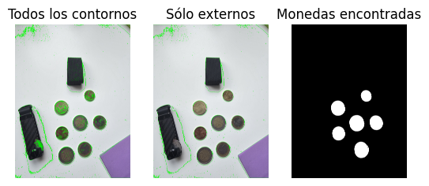
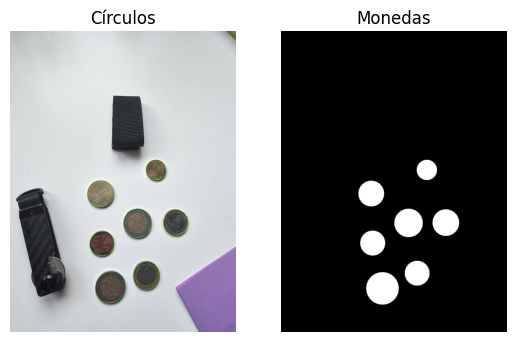
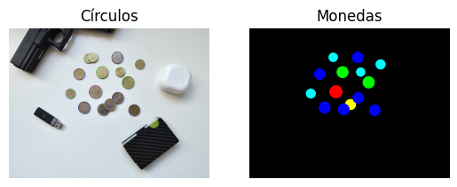

## Práctica 3. Detección de formas

**Jose Manuel Hernández Aparicio && Sheila Cazorla Rodriguez**

En esta práctica el objetivo es extraer información geométrica de los objetos presentes en una imagen e identificar monedas, tanto solpadas como no, e identificar de qué tipo son. También se ha realizado un clasificador de microplasticos

### Tarea 1: 
**Captura una o varias imágenes con monedas no solapadas y algún objeto que no lo sea. Filtra los contornos que no se correpondan con monedas, y muestra el número total de monedas presentes en la imagen.**

Esta tarea ha sido realizada de dos formas: 
1. La primera es con la función [**cv2.findContours**](https://docs.opencv.org/4.x/d4/d73/tutorial_py_contours_begin.html), para identificar cuales son monedas y cuales no, establecemos una condición en la que se calcula la diferencia relativa entre la relación área-perímetro del contorno y el valor teórico de un círculo perfecto, para que la condición se cumpla, esta relación debe ser menor que un umbral máximo y un umbral mínimo.
De esta forma se han encontrado 6 de las 7 monedas.

2. La otra forma ha sido usando [**cv2.HoughCircles**](https://docs.opencv.org/4.x/da/d53/tutorial_py_houghcircles.html), tras ajustar varios parámetros de configuración, ha encontrado todas las monedas de forma bastante exacta.

### Tarea 2: 
**Captura una o varias imágenes con monedas no solapadas, y otras con monedas solapadas. Identificada una moneda de un euro en la imagen, por ejemplo con un clic de ratón, calcular la cantidad de dinero presente en la imagen. ¿Qué problemas han observado?**

Al ser el método más preciso de la tarea anterior, hemos decicido emplear [**cv2.HoughCircles**](https://docs.opencv.org/4.x/da/d53/tutorial_py_houghcircles.html), para empezar, has sido necesaria la especificación de un radio mínimo y uno máximo para eliminar la mayoría de las formas circulares erroneas, aún así, para eliminarlas por completo, hemos tenido que aumentar el valor del gradiente y el umbral acumulador, para hacer que sea más exigente a la hora de identificar las monedas. 

Con todas estas modificaciones, hemos conseguido detectar todas las monedas a escepción de una de 10 céntimos que está solapada debajo de otra, al verse muy poco de ésta, la función no la considera una esfera. Podríamos relajar las restricciones para que sí apareciera, pero esto daría lugar a varios falsos positivos.

La identificación del valor de las monedas se basa en el área de la misma, lo cual no se hace del todo exacto ya que dependiendo de como se haya tomado la foto, algunas monedas pueden parecer más grandes que otras. Por ejemplo, las monedas de 20 céntimos las confunde con monedas de 1 euro, así mismo, hay una moneda de 1 euro que tiene un area similar a una de 20 céntimos.

Problemas encontrados:

* En función de como se haya sacado la foto, algunas monedas pueden tener un area menor o mayor a la que realmente tienen, lo cual imposibilita la clasificación exacta de las mismas con este método.
* Las sombras en la imagen contribuyen de forma perjudicial a la identificación exacta de las mismas
* Es extremadamente complicado encontrar una configuración en la que no se detecten falsos positivos y, simultanemante, identifique de forma correcta todas las monedas solapadas.
* Intentar hallar una relación entre los píxeles de las monedas identificadas, y una medida en mm o cm carece de sentido, ya que esa relación valdría solo para fotos con la misma resolución, mismo ángulo, y misma distancia entre el objetivo y las monedas, que el que se usó para hallar esa relación.

### Tarea 3: 
**Estas tres imágenes han sido extraidas de las imágenes de mayor tamaño contenidas en la carpeta. Determina patrones geométricos para cada una de las tres clases y evalúa los aciertos y fallos con las imágenes completas la matriz de confusión. Para cada clase, determina el número de muestras que se clasifican correctamente de dicha clase, y el número de muestras que se clasifica incorrectamente por cada una de las otras dos clases.**

Para empezar, procesas las imagenes, cada una de ellas con humbrales diferentes para que los contornos sean lo más precisos posibles, acto seguido hemos filtrado los contornos en función de su tamaño para que solo queden contornos superiores a cierta dimensión, así eliminamos falsos positivos en la detección. 

Una vez contamos con las listas de contornos filtrados, ejecutamos los clasificadores en cada una de ellas y guardamos los resultados en una matriz que imprimiremos para obtener una matriz de confusión.

Para la creación de los clasificadores, primero hemos analizado los contornos de cada muestra, imprimiendo el area, perímetro, compasidad, y relación de aspecto de las mismas para ver si conseguíamos identificar un patrón claro que diferenciase unas de otras. Las conclusiones a las que llegamos fueron las siguientes:

* La mayoría de las muestras PEL son mucho más esféricas y compactas que las otras dos, así mismo, no tienen colores excesivamente oscuros.
* La mayoría de las muestras FRA tienen formas alargadas, irregulares y de colores claros.
* La mayoría de las muestras TAR tienen formas geométricas muy similares a las de FRA, con la excepción de que las TAR son todas de tonalidades negros.

Los clasificadores han sido diseñados siguiendo estos parámetros, un aspecto muy determinante para diferenciar entre FRA y TAR es el color del contorno. 

La matriz de confusión obtenida es la siguiente:
