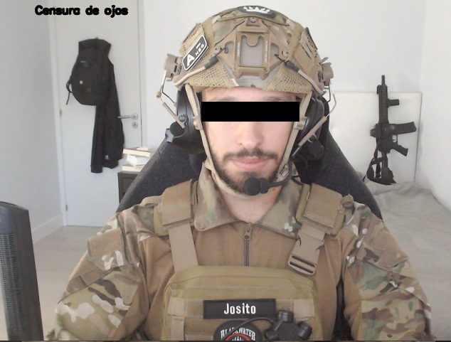
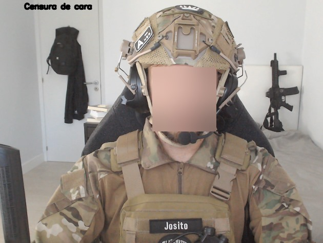
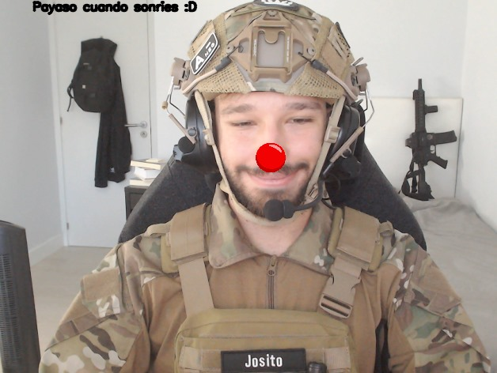

# Práctica 4: Detección de Caras

**Autores:** José Manuel Hernández Aparicio & Sheila Cazorla Rodriguez

En esta práctica, hemos desarrollado varios filtros que utiliza DLIB68. A continuación, explicaremos cada uno de estos filtros.

## Modo 1: Censurador de Ojos

Hemos implementado un filtro inspirado en las imágenes de militares en las que se censuran los ojos. El funcionamiento de este filtro se basa en el procesamiento de los landmarks faciales para identificar los puntos extremos verticales y horizontales de ambos ojos. Luego, se agrega un pequeño margen para alargar el rectángulo encargado de la censura. Este rectángulo consiste en la sustitución de los píxeles en el área que comprende los extremos mencionados anteriormente con píxeles negros.

## Modo 2: Censura por Pixelado

En este segundo modo de censura, se busca pixelar toda la cara. El proceso involucra:
- Identificación de las coordenadas y dimensiones del rectángulo que contiene la cara.
- Reducción de la resolución del marco de la cara utilizando [cv2.resize](https://docs.opencv.org/3.4/da/d54/group__imgproc__transform.html#ga47a974309e9102f5f08231edc7e7529d), lo que crea un efecto de pixelado.
- Aplicación de interpolación lineal para restaurar el tamaño original del marco antes de volver a insertarlo en la imagen.

## Modo 3: Censura Gaussiana

En el tercer modo, se utiliza una censura gaussiana. El funcionamiento es similar al modo 2:
- Identificación de las coordenadas y dimensiones del rectángulo que contiene la cara.
- Aplicación de un desenfoque gaussiano ([cv2.GaussianBlur](https://docs.opencv.org/4.x/d4/d13/tutorial_py_filtering.html)) al marco de la cara.
- Inserción del marco censurado en la imagen.

## Modo 4: Detector de Sonrisas

En el último modo, se detectan sonrisas en la imagen procesando los puntos asociados a la boca. El proceso implica:
- Cálculo del ángulo entre tres puntos específicos que representan la boca en una cara, a saber 48, 54 y 57.
- Comparación de este ángulo con un umbral predefinido (`ANGLE_THRESHOLD`) para determinar si se ha detectado una sonrisa.
- Si se detecta una sonrisa, se agrega una nariz de payaso a la persona.

