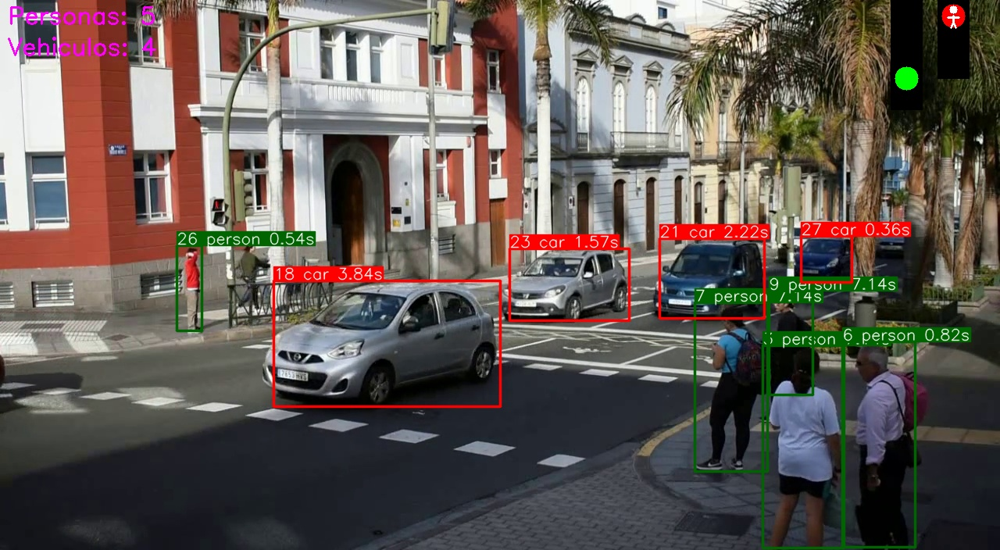
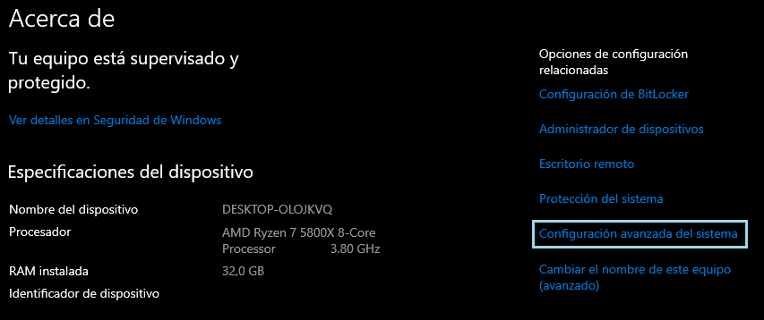
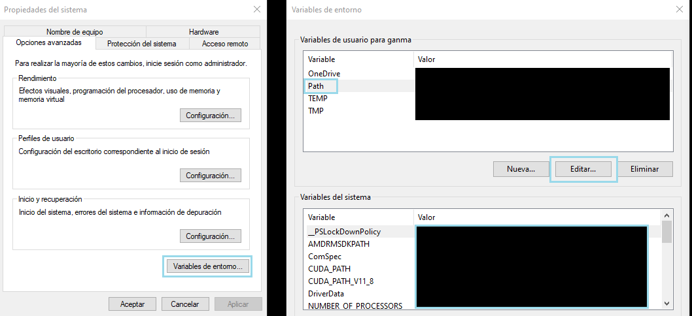
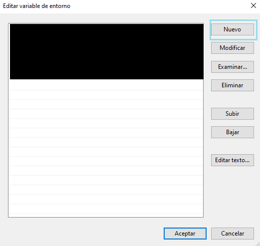
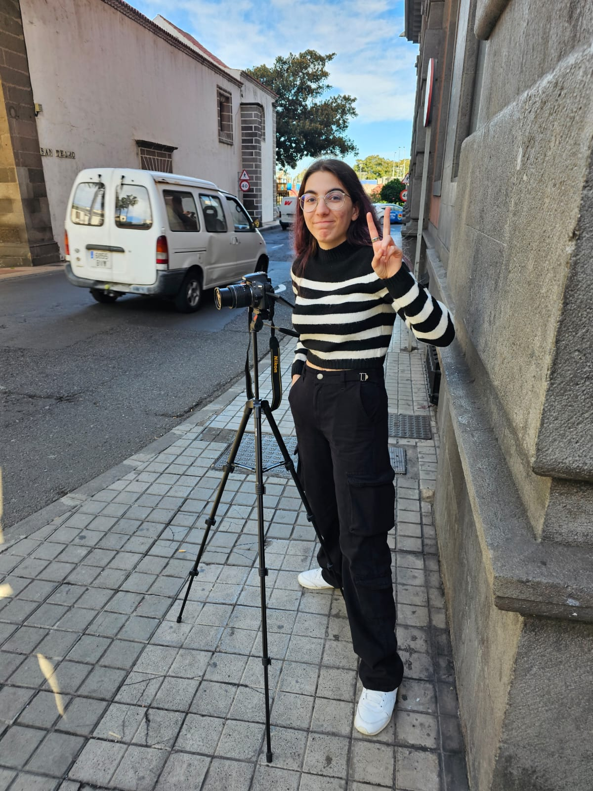
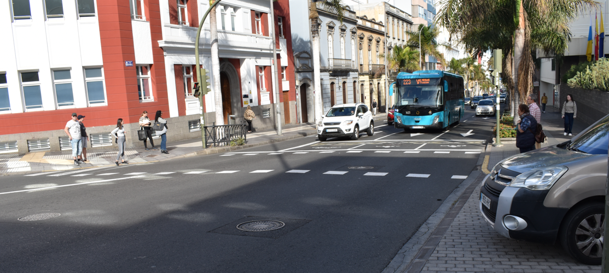
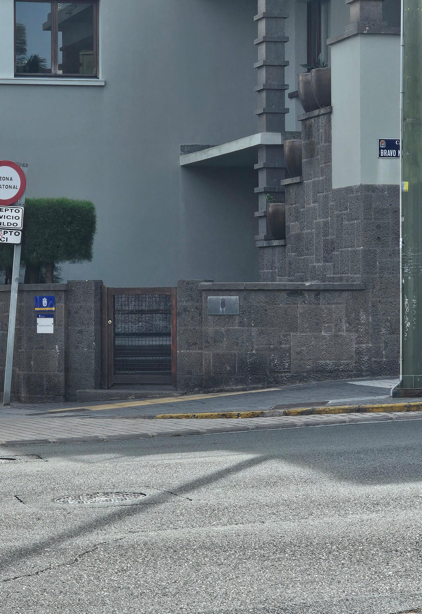
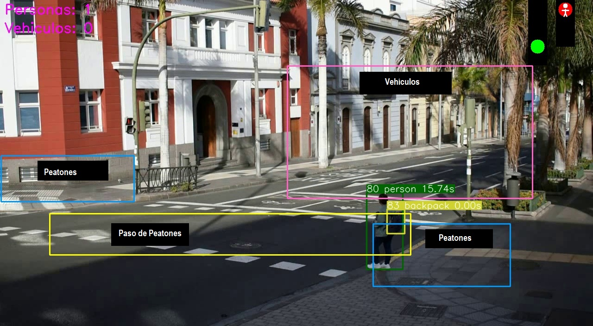
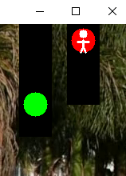

<center>

# Trabajo Fin de Curso: Automatización de Semáforos
**Autores:** Josito Manuel Hernández Aparicio & Sheila Cazorla Rodriguez


<figure>
  
</figure>
</center>

## Contenidos
- [Motivación del Trabajo](#motivación-del-trabajo)
- [Objetivo de la propuesta](#objetivo-de-la-propuesta)
- [Desarrollo](#desarrollo)
    -[Tecnologías Empleadas](#tecnologías-empleadas)
    -[Preparación del entorno](#preparación-del-entorno)
    -[Ubicación Seleccionada](#ubicación-seleccionada)
    -[Preparación del Vídeo](#preparación-del-vídeo)
    -[Delimitación de las Zonas](#delimitación-de-las-zonas)
    -[Ejecución Final](#ejecución)
- [Resultado Final](#resultado-final)

## Motivación del trabajo 
La motivación del trabajo surge a raíz de fatídicas experiencias vividas en semáforos por los colaboradores de este proyecto.

## Objetivo de la propuesta

El objetivo de este trabajo consiste en la implantación de un semáforo automático, el cual se vale de [***yolov8***](https://docs.ultralytics.com/es/) para el reconocimiento tanto de vehículos como de peatones y [***ByteTrack***](https://github.com/ifzhang/ByteTrack) para el trackeo de dichos objetos. 

La intención es que, en vez de funcionar como un semáforo convencional en el que los tiempos están predefinidos, programa controlará cuantos vehículos y peatones llevan esperando a que su semáforo se ponga en verde y, en función del número de estos y del tiempo que lleven esperando, cederá el paso de una forma justa. 

De esta forma, se espera evitar tiempos ociosos o situaciones en las que se una gran cantidad de peatones esté esperando con el semáforo en rojo cuando el número de coches en transito es claramente inferior al de peatones, de igual forma se traslada en el caso de los vehículos.

## Desarrollo 

### Tecnologías empleadas
Como ya ha sido mencionado, el programa ha sido desarrollado en python, empleando principalmente [***yolov8***](https://docs.ultralytics.com/es/) y [***ByteTrack***](https://github.com/ifzhang/ByteTrack). Alojado todo en un enviroment de [**Anaconda**](https://www.anaconda.com). Para el correcto funcionamiento de ByteTrack, es necesario tener instalado en el equipo [**Microsoft C++ Build Tools**](https://visualstudio.microsoft.com/visual-cpp-build-tools/), para la preparación de los videos se hizo uso de [**FFmpeg**](https://ffmpeg.org).

Para la implementación de bytrack hemos seguido la guía del [**github de jbagnato**](https://github.com/jbagnato/machine-learning/tree/master/yolo_tracking)

Para un mayor rendimiento, hemos usado [**CUDA**](https://developer.nvidia.com/cuda-11-8-0-download-archive) para ejeutarlo en una RTX 3080TI de 12 Gigas.

El proceso de instalación de todas las tecnologías mencionadas, así como sus dependencias, serán explicadas a continuación.

### Preparación del entorno
Comenzaremos creando el entorno oportuno en Anaconda, para evitar fallos de compatibilidad, se ha empleando Python 3.9.18 en vez de su versión más reciente.

```
conda create --name nombre_enviroment python = 3.9.18
```
Lo activamos usando 
```
conda activate nombre_enviroment
```
Las dependencias necesarias están señaladas en el fichero [requirements.txt](./requirements.txt), antes de instalarlas. Una de las dependencias, requerida para usar [***ByteTrack***](https://github.com/ifzhang/ByteTrack), es [**Linear Assignment Problem Solver**](https://github.com/gatagat/lap) o "lap". Para que funcione debemos de tener [**Microsoft C++ Build Tools**](https://visualstudio.microsoft.com/visual-cpp-build-tools/). Procedemos a descargarlo de su página oficial, ejecutar el instalador y seleccionar la opción siguiente:

<figure>
  
  <figcaption><strong>Opción marcada con recuadro azúl</strong></figcaption>
</figure>

Ahora podemos instalar todas las dependencias señaladas en el fichero [requirements.txt](./requirements.txt).

```
pip install -r requirements.txt
```
Para modificar el video que usaremos en la demostración, y ajustarlo a conveniencia, deberemos instalar [**FFmpeg**](https://ffmpeg.org). 

Una vez descargado, lo descomprimiremos y lo ubicaremos en la zona que elijamos, para que el sistema operativo pueda reconocerlo, deberemos de introducir el path correspondiente al fichero binario del mismo. 

Así pues, deberemos acceder a la carpeta <strong>bin</strong> y copiaremos la ruta absuluta.

Ahora accederemos a la ventana de sistema de Windows y seleccionaremos <strong>"Configuración avanzada del sistema" </strong>
<center>
<figure>
  
  
  <figcaption><strong>Opción marcada con recuadro azúl</strong></figcaption>
  
</figure>
</center>
Se abrirá la siguiente ventana:

<center>
<figure>
  
  <figcaption><strong>Opciones elegidas, de izquierda a derecha, en azúl</strong></figcaption>
</figure>
</center>
Como se ve marcado, deberemos darle a <strong>Variables de entorno</strong>, se abrirá otra ventana y en ella seleccionaremos <strong>Path</strong>, acto seguido apretaremos en <strong>Editar...</strong>, lo cual abrirá otra ventana:

<center>
<figure>
  
  <figcaption><strong>Opción elegida en azúl</strong></figcaption>
</figure>
</center>

Seleccionaremos <strong>Nuevo</strong> e introduciremos la ruta absoluta de los binarios de [**FFmpeg**](https://ffmpeg.org) que copiamos previamente.

El uso de [**CUDA**](https://developer.nvidia.com/cuda-11-8-0-download-archive) es totalmente opcional ya que el código está preparado para ambos escenarios, no obstante, es altamente recomendable.

Para ello, deberemos de ejecutar un comando para ver cual es la versión compatible más reciente 
```
conda search cudatoolkit
```
En nuestro caso es la 11.8, procederemos a instalarla junto con otras dependencias también necesarias.
```
conda install pytorch torchvision torchaudio pytorch-cuda=11.8 -c pytorch -c nvidia
```

### Ubicación Seleccionada
Para el desarrollo de la práctica, era necesario encontrar un video de un paso de peatones. Los requisitos que, a nuestro juicio, debería de cumplir son los siguientes:
- <strong>El video no puede estar muy alejado del paso de peatones.</strong> Ya que eso dificultaría la identificación de los objetos 
- <strong>El video debe de tener una calidad aceptable.</strong> Cuanto más claro y nítido se vea, más sencilla será la identificación y tracking de los objetos.
- <strong>El video debe de haber sido grabado a cierta altura.</strong> En un video grabado a nivel del suelo, no se verán los coches por detrás de la primera fila de espera, lo cual impide su contabilización y por ende afectará desempeño del programa.
- <strong>Se deben de visualizar las zonas de espera para peatones en ambos lados de la carretera.</strong>

Al principio se intentó extraer un video de internet, lo cual fue imposible ya que ninguno cumplía con la mayoría de puntos previamente mencionados. La solución elegida fue grabar los videos por nuestra cuenta.

<center>
    <figure>
        
        
        <figcaption><strong>Intrépidos ingenieros haciendo de fotógrafos</strong></figcaption>
    </figure>
</center>

Tras estar grabando varios cruces, los cuales acabaron siendo descartados, conseguimos encontrar el [lugar idóneo](https://www.google.es/maps/@28.10789,-15.4203447,3a,90y,72.31h,85.74t/data=!3m6!1e1!3m4!1sc3dn9OyUashkpVrEfs6nRA!2e0!7i16384!8i8192?entry=ttu). La carretera es grande y frecuentemente transitada tanto por vehículos como por peatones.

<center>
    <figure>
        
    </figure>
</center>
Para conseguir cierto grado de vista aerea, nos subimos a un muro de un edificio del gobierno y estuvimos grabando hasta que la seguridad nos echó.
<center>
    <figure>
        
    </figure>
</center>


### Preparación del vídeo

Al ser grabada con una cámara de calidad, el vídeo tiene una resolución excesiva, así pues, creamos algunas funciones, ubicadas en el fichero [**funciones_auxiliares.ipynb**](./funciones_auxiliares.ipynb) usando [**openCV**](https://pypi.org/project/opencv-python/) para reducirle calidad, los cambios hechos al video original son los siguientes:

- <strong>Reducción de la resolución a 1280 * 720 píxeles</strong>
- <strong>Reducción de la resolución vertical hasta un múltiplo de 32 para que sea compatible con CUDA</strong>
- <strong>Reducción de los fotogramas a 24</strong>

No obstante, al terminar de hacer todos estos cambios, nos daremos cuenta de que el video final puede llegar a pesar hasta el triple que el original, cosa que no tiene sentido después de todos estos cambios, esto se debe a que, por defecto, los cambios hechos por [**openCV**](https://pypi.org/project/opencv-python/) dejan el video con un bitrate exageradamente alto, por ello, emplearemos [**FFmpeg**](https://ffmpeg.org) para reducirselo.

```
import subprocess

def make_video_lighter(input_video_path, output_video_path, bitrate='1M'):
    try:
        # Comando FFmpeg para ajustar el bitrate
        command = [
            'ffmpeg', '-i', input_video_path, 
            '-b:v', bitrate, 
            '-bufsize', bitrate, 
            output_video_path
        ]
        # Ejecutar el comando
        subprocess.run(command, check=True)
        print(f"Video reducido guardado como '{output_video_path}' con bitrate de {bitrate}.")
    except subprocess.CalledProcessError as e:
        print(f"Error al ejecutar FFmpeg: {e}")

# Uso de la función
make_video_lighter('../../resized_720_24_fps.mp4', '../../stream_bitrate2.mp4', '3M') 
```
La ejecución puede llegar a ser algo volátil, en caso que cualquier problema o tiempo de ejecución infinito, ejecutar mediante terminal de la siguiente forma:

```
ffmpeg -i .ruta_video_original -b:v 2000k -bufsize 3000k ruta_video_final
```
<strong>**Puede ser necesario usar "\\" en vez de "/"</strong>

Con el video preparado, podemos proceder a definir lo que interpretaremos como zonas de espera.

### Delimitación de las zonas
Para definir las zonas hemos añadido un bloque de código al cuaderno que, al ejecutarse, mostrará el video y permitirá marcar, apretando en la ventana del mismo, marcar un recuadro que delimite la zona, una vez marcado, al darle a esc, imprimirá las coordenadas de inicio y final del recuadro. 

Es importante que el video en el que se marca la zona y el video sobre el que se van a aplicar tengan las mismas dimensiones. Así como el marcar el recuadro de izquierda a derecha, ya que de hacerlo de derecha a izquierda, te dará el punto de inicio y final al revés.

<p align="center">
  
</p>

Hemos definido un total de 4 zonas:

<center>
    <figure>
        
    </figure>
</center>

### Ejecución Final

A continuación se procede a explicar el código final del trabajo, ubicado en el fichero [trabajo_final.ipynb](./trabajo_final.ipynb) se obviaran los detalles más simples.

Comenzaremos importando las dependencias necesarias, acto seguido definiremos los parámetros del modelo de detección.

```
conf_thres = 0.25
iou_thres = 0.45
classes = [0, 2, 3, 5, 7, 1] #Solo nos interesa que reconozca las personas y los vehículos terrestres
agnostic_nms = False
max_det = 1000
line_thickness = 2
half = False
imgsz = (1280, 704) #Cambiar a las dimensiones exactas
vid_stride = 1
```

Es una configuración bastante simple, los cambios más importantes son la especificación de las clases que queremos que detecte, en este caso, personas y vehículos terrestres.

Luego especificamos la ruta del video ya modificado con las funciones anteriores. Ahora definiremos el dispositivo en el que queremos que se ejecute la detección:

```
device = torch.device("cuda" if torch.cuda.is_available() else "cpu")
print("Usando dispositivo:", device)
```
De esta forma se podrá ejecutar aún cuando el dispositivo no tenga tarjeta gráfica o no haya podido configurar [**CUDA**](https://developer.nvidia.com/cuda-11-8-0-download-archive) correctamente.

Ahora configuraremos el tracker:

```
bytetracker = BYTETracker(
    track_thresh=0.6, match_thresh=0.8, track_buffer=120, frame_rate=24
)
tracker = bytetracker
```
- <strong>BYTETracker</strong> es una clase que implementa el algoritmo de seguimiento de objetos
- <strong>track_thresh=0.6</strong> es el umbral de seguimiento. Define la confianza mínima para que un objeto sea considerado en el seguimiento. Un valor de 0.6 significa que cualquier detección con una confianza menor al 60% será descartada.
- <strong>match_thresh=0.8</strong> Este es el umbral de coincidencia. Se utiliza para decidir si dos detecciones en frames consecutivos corresponden al mismo objeto.
- <strong>track_buffer=120 </strong> Es el tamaño del buffer de seguimiento. Define cuántos frames se mantendrán en memoria para el seguimiento. 
-<strong>frame_rate=30</strong> Especifica la tasa de cuadros por segundo (FPS) del video.  

Luego cargamos el video en una variable para procesarlo y creamos las listas que corresponden con las coordenadas de las zonas, así como los diccionarios que guardarán los ids de los objetos que se encuentran en cada zona junto con el tiempo que lleva esperando.

Para comprobar si el objeto se encuentra en la zona, simplemente verificamos si el recuadro que identifica al objeto toca, por poco que sea, la zona delimitada.

```
def interseccion_zona(bbox, zona):
    """ Verifica si la caja delimitadora (bbox) se cruza con la zona definida. """
    x1, y1, x2, y2 = bbox
    zx1, zy1, zx2, zy2 = zona
    return not (x2 < zx1 or x1 > zx2 or y2 < zy1 or y1 > zy2)
```
El bloque de código posterior se usa únicamente para dibujar los semáforos en la imagen:

<center>
    <figure>
        
        <figcaption><strong>Semáforo meramente representativo, pendiente de mejorar</strong></figcaption>
    </figure>
</center>

Seguido del mismo tenemos la clase que se encarga de controlar la lógica del semáforo, esta clase cuenta con variables que serán usadas para llevar un registro de la información del frame en el que se ha llamado a la función “asignar_estado_semaforo”. 

Primeramente se obtiene los tiempos de espera totales y se imprimen, luego se comprueba si la cantidad de vehículos es mayor que la de personas y si el tiempo de espera de estos es mayor que el tiempo de espera de las personas, o también si hay menos vehículos pero éstos llevan esperando más tiempo, por último comprobamos de forma individual cada vehículo para que su tiempo de espera no sobrepase un umbral, estas mismas comparaciones se hacen con las personas, y así definimos el estado del semáforo. 

Por último, hace un borrado de los tiempos de espera guardados para la siguiente ejecución de la función.

La función final que stremea visualmente el vídeo junto con el semáforo y los objetos detectados, sigue el esquema típico de identificación pero unido al tracking de [***ByteTrack***](https://github.com/ifzhang/ByteTrack). Para asegurarnos de que solo tiene en cuenta los objetos ubicados en las zonas correspondientes, tenemos varias sentencias de comprobación similares a esta:

```
if c == 0 and (interseccion_zona(bbox, zona_personas) or interseccion_zona(bbox, zona_personas2)):
```
Como se puede ver comprueba si el objeto es de tipo persona y luego si se encuentra en alguna de las dos zonas de espera de peatones. En caso de que se cumpla se ejecutará la siguiente sección del código:
```
contador_personas +=1
contador_semaforo.contador_personas = contador_personas
# Verificar si el objeto persona está dentro de la zona personas
if id not in tiempo_espera_personas:
    tiempo_espera_personas[id] = tiempo_actual

tiempo_deteccion = tiempo_actual - tiempo_espera_personas[id]
contador_semaforo.tiempo_espera_personas[id] = tiempo_deteccion                    
color_especial = (0, 100, 0) # Color verde fuerte
```
Como se puede ver, primero comprueba si el objeto ya estaba en la lista de espera en el frame anterior, en caso de que no lo esté, lo añade, en caso de que ya esté actualiza el tiempo que lleva esperando, acto seguido actualiza la información en el objeto semáforo y resalta el recuadro del objeto de un color diferente al normal para remarcar visualmente que se encuentra en la zona

### Resultado Final

La automatización completa resulta imposible ya que el video y el movimiento de las personas y vehículos no puede ser alterado. Así pues, hemos preferido que el semaforo se cambie (en función de todo lo descrito previamente) al apretar la telca <strong>"q"</strong>, alternativamente, también es posible imprimir por consola el tiempo que tardan los peatones en cruzar el paso de peatón. Para ello basta con apretar la telca <strong>m</strong>.

<p align="center">
  
</p>

Para acceder al video explicativo, acceder a este [enlace](https://alumnosulpgc-my.sharepoint.com/:v:/g/personal/sheila_cazorla101_alu_ulpgc_es/ERukA6Qgt-hElSIlywQKAzQBD0mPokPXhpLIse9Cq_iVzw?nav=eyJyZWZlcnJhbEluZm8iOnsicmVmZXJyYWxBcHAiOiJPbmVEcml2ZUZvckJ1c2luZXNzIiwicmVmZXJyYWxBcHBQbGF0Zm9ybSI6IldlYiIsInJlZmVycmFsTW9kZSI6InZpZXciLCJyZWZlcnJhbFZpZXciOiJNeUZpbGVzTGlua0NvcHkifX0&e=WwwsZM)