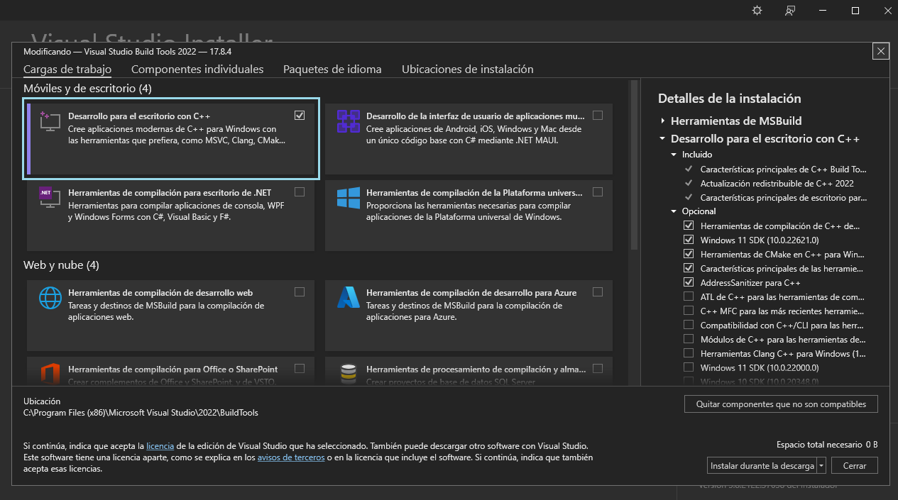
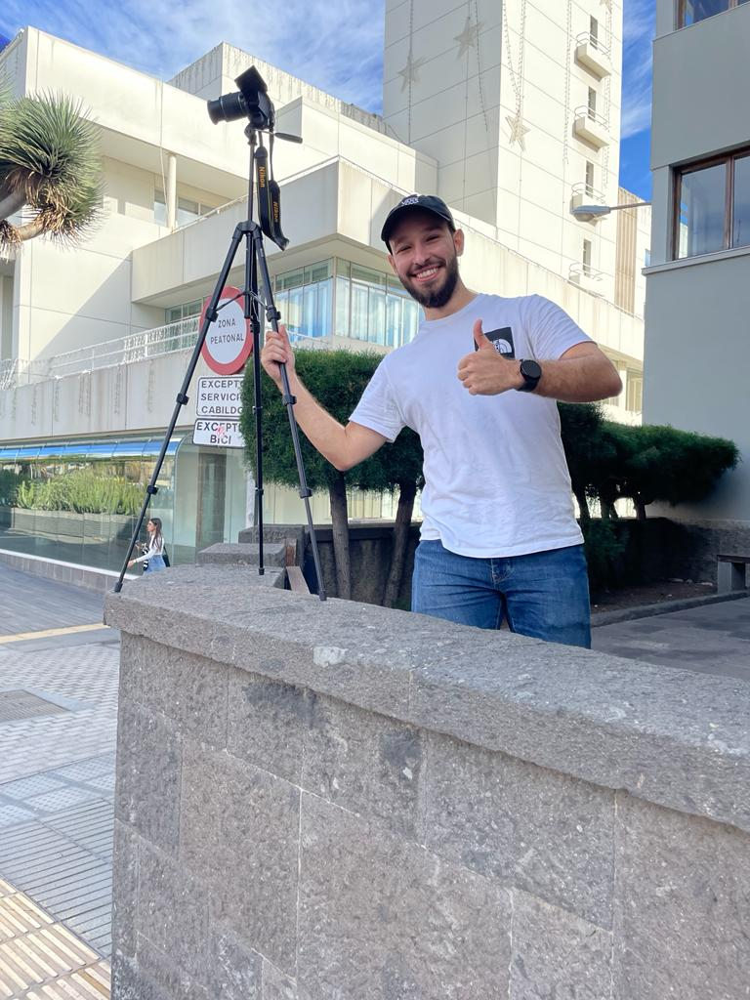

<center>

# Trabajo Fin de Curso: Automatización de Semáforos
**Autores:** Josito Manuel Hernández Aparicio & Sheila Cazorla Rodriguez


<figure>
  
</figure>
</center>

## Contenidos
- [Motivación del Trabajo](#motivación-del-trabajo)
- [Objetivo de la propuesta](#objetivo-de-la-propuesta)
- [Desarrollo](#desarrollo)
    -[Tecnologías Empleadas](#tecnologías-empleadas)
    -[Preparación del entorno](#preparación-del-entorno)
    -[Ubicación Seleccionada](#ubicación-seleccionada)
    -[Preparación del Vídeo](#preparación-del-vídeo)
    -[Delimitación de las Zonas](#)


## Motivación del trabajo 
La motivación del trabajo surgió cuando Josito tuvo que esperar, bajo la lluvia, por la noche, 2 minutos con el semáforo en rojo mientras veía como de vez en cuando pasaba algún que otro coche

La motivación del trabajo surge a raíz de fatídicas experiencias vividas en semáforos por los colaboradores de este proyecto.

## Objetivo de la propuesta

El objetivo de este trabajo consiste en la implantación de un semáforo automático, el cual se vale de [***yolov8***](https://docs.ultralytics.com/es/) para el reconocimiento tanto de vehículos como de peatones y [***ByteTrack***](https://github.com/ifzhang/ByteTrack) para el trackeo de dichos objetos. La intención es que, en vez de funcionar como un semáforo convencional en el que los tiempos están predefinidos, programa controlará cuantos vehículos y peatones llevan esperando a que su semáforo se ponga en verde y, en función del número de estos y del tiempo que lleven esperando, cederá el paso de una forma justa. De esta forma, se espera evitar tiempos ociosos o situaciones en las que se una gran cantidad de peatones esté esperando con el semáforo en rojo cuando el número de coches en transito es claramente inferior al de peatones, de igual forma se traslada en el caso de los vehículos.

## Desarrollo 

### Tecnologías empleadas
Como ya ha sido mencionado, el programa ha sido desarrollado en python, empleando principalmente [***yolov8***](https://docs.ultralytics.com/es/) y [***ByteTrack***](https://github.com/ifzhang/ByteTrack). Alojado en un enviroment de [**Anaconda**](https://www.anaconda.com). Para el correcto funcionamiento de ByteTrack, es necesario tener instalado en el equipo [**Microsoft C++ Build Tools**](https://visualstudio.microsoft.com/visual-cpp-build-tools/), para la preparación de los videos se hizo uso de [**FFmpeg**](https://ffmpeg.org).

Para un mayor rendimiento, hemos usado [**CUDA**](https://developer.nvidia.com/cuda-11-8-0-download-archive) para ejeutarlo en una RTX 3080TI de 12 Gigas.

El proceso de instalación de todas las tecnologías mencionadas, así como sus dependencias, serán explicadas a continuación.

### Preparación del entorno
Comenzaremos creando el entorno oportuno en Anaconda, para evitar fallos de compatibilidad, se ha empleando Python 3.9.18 en vez de su versión más reciente.

```
conda create --name nombre_enviroment python = 3.9.18
```
Lo activamos usando 
```
conda activate nombre_enviroment
```
Las dependencias necesarias están señaladas en el fichero [requirements.txt](./requirements.txt), antes de instalarlas. Una de las dependencias, requerida para usar [***ByteTrack***](https://github.com/ifzhang/ByteTrack), es [**Linear Assignment Problem Solver**](https://github.com/gatagat/lap) o "lap". Para que funcione debemos de tener [**Microsoft C++ Build Tools**](https://visualstudio.microsoft.com/visual-cpp-build-tools/). Procedemos a descargarlo de su página oficial, ejecutar el instalador y seleccionar la opción siguiente:

<figure>
  
  <figcaption><strong>Opción marcada con recuadro azúl</strong></figcaption>
</figure>

Ahora podemos instalar todas las dependencias señaladas en el fichero [requirements.txt](./requirements.txt).

```
pip install -r requirements.txt
```
Para modificar el video que usaremos en la demostración, y ajustarlo a conveniencia, deberemos instalar [**FFmpeg**](https://ffmpeg.org). 

Una vez descargado, lo descomprimiremos y lo ubicaremos en la zona que elijamos, para que el sistema operativo pueda reconocerlo, deberemos de introducir el path correspondiente al fichero binario del mismo. 

Así pues, deberemos acceder a la carpeta <strong>bin</strong> y copiaremos la ruta absuluta.

Ahora accederemos a la ventana de sistema de Windows y seleccionaremos <strong>"Configuración avanzada del sistema" </strong>
<center>
<figure>
  
  
  <figcaption><strong>Opción marcada con recuadro azúl</strong></figcaption>
  
</figure>
</center>
Se abrirá la siguiente ventana:

<center>
<figure>
  
  <figcaption><strong>Opciones elegidas, de izquierda a derecha, en azúl</strong></figcaption>
</figure>
</center>
Como se ve marcado, deberemos darle a <strong>Variables de entorno</strong>, se abrirá otra ventana y en ella seleccionaremos <strong>Path</strong>, acto seguido apretaremos en <strong>Editar...</strong>, lo cual abrirá otra ventana:

<center>
<figure>
  
  <figcaption><strong>Opción elegida en azúl</strong></figcaption>
</figure>
</center>

Seleccionaremos <strong>Nuevo</strong> e introduciremos la ruta absoluta de los binarios de [**FFmpeg**](https://ffmpeg.org) que copiamos previamente.

El uso de [**CUDA**](https://developer.nvidia.com/cuda-11-8-0-download-archive) es totalmente opcional ya que el código está preparado para ambos escenarios, no obstante, es altamente recomendable.

Para ello, deberemos de ejecutar un comando para ver cual es la versión compatible más reciente 
```
conda search cudatoolkit
```
En nuestro caso es la 11.8, procederemos a instalarla junto con otras dependencias también necesarias.
```
conda install pytorch torchvision torchaudio pytorch-cuda=11.8 -c pytorch -c nvidia
```

### Ubicación Seleccionada
Para el desarrollo de la práctica, era necesario encontrar un video de un paso de peatones. Los requisitos que, a nuestro juicio, debería de cumplir son los siguientes:
- <strong>El video no puede estar muy alejado del paso de peatones.</strong> Ya que eso dificultaría la identificación de los objetos 
- <strong>El video debe de tener una calidad aceptable.</strong> Cuanto más claro y nítido se vea, más sencilla será la identificación y tracking de los objetos.
- <strong>El video debe de haber sido grabado a cierta altura.</strong> En un video grabado a nivel del suelo, no se verán los coches por detrás de la primera fila de espera, lo cual impide su contabilización y por ende afectará desempeño del programa.
- <strong>Se deben de visualizar las zonas de espera para peatones en ambos lados de la carretera.</strong>

Al principio se intentó extraer un video de internet, lo cual fue imposible ya que ninguno cumplía con la mayoría de puntos previamente mencionados. La solución elegida fue grabar los videos por nuestra cuenta.

<center>
    <figure>
        
        
        <figcaption><strong>Intrépidos ingenieros haciendo de fotógrafos</strong></figcaption>
    </figure>
</center>

Tras estar grabando varios cruces, los cuales acabaron siendo descartados, conseguimos encontrar el [lugar idóneo](https://www.google.es/maps/@28.10789,-15.4203447,3a,90y,72.31h,85.74t/data=!3m6!1e1!3m4!1sc3dn9OyUashkpVrEfs6nRA!2e0!7i16384!8i8192?entry=ttu). La carretera es grande y frecuentemente transitada tanto por vehículos como por peatones.

<center>
    <figure>
        
    </figure>
</center>
Para conseguir cierto grado de vista aerea, nos subimos a un muro de un edificio del gobierno y estuvimos grabando hasta que la seguridad nos echó.
<center>
    <figure>
        
    </figure>
</center>


### Preparación del vídeo

Al ser grabada con una cámara de calidad, el vídeo tiene una resolución excesiva, así pues, creamos algunas funciones, ubicadas en el fichero [VC_TRABAJO](./VC_TRABAJO.ipynb) usando [openCV](https://pypi.org/project/opencv-python/) para reducirle calidad, los cambios hechos al video original son los siguientes:

- <strong>Reducción de la resolución a 1280 * 720 píxeles</strong>
- <strong>Reducción de la resolución vertical hasta un múltiplo de 32 para que sea compatible con CUDA</strong>
- <strong>Reducción de los fotogramas a 24</strong>

No obstante, al terminar de hacer todos estos cambios, nos daremos cuenta de que el video final puede llegar a pesar hasta el triple que el original, cosa que no tiene sentido después de todos estos cambios, esto se debe a que, por defecto, los cambios hechos por [openCV](https://pypi.org/project/opencv-python/) dejan el video con un bitrate exageradamente alto, por ello, emplearemos [**FFmpeg**](https://ffmpeg.org) para reducirselo.

```
import subprocess

def make_video_lighter(input_video_path, output_video_path, bitrate='1M'):
    try:
        # Comando FFmpeg para ajustar el bitrate
        command = [
            'ffmpeg', '-i', input_video_path, 
            '-b:v', bitrate, 
            '-bufsize', bitrate, 
            output_video_path
        ]
        # Ejecutar el comando
        subprocess.run(command, check=True)
        print(f"Video reducido guardado como '{output_video_path}' con bitrate de {bitrate}.")
    except subprocess.CalledProcessError as e:
        print(f"Error al ejecutar FFmpeg: {e}")

# Uso de la función
make_video_lighter('../../resized_720_24_fps.mp4', '../../stream_bitrate2.mp4', '3M') 
```
La ejecución puede llegar a ser algo volátil, en caso que cualquier problema o tiempo de ejecución infinito, ejecutar mediante terminal de la siguiente forma:

```
ffmpeg -i .ruta_video_original -b:v 2000k -bufsize 3000k ruta_video_final
```
<strong>**Puede ser necesario usar "\\" en vez de "/"</strong>

Con el video preparado, podemos proceder a definir lo que interpretaremos como zonas de espera.

### Delimitación de las zonas
Para definir las zonas hemos añadido un bloque de código al cuaderno que, al ejecutarse, mostrará el video y permitirá marcar, aprentando en la ventana del mismo, marcar un recuadro que delimite la zona, una vez marcado, al darle a esc, imprimirá las coordenadas de inicio y final del recuadro. 

Es importante que el video en el que se marca la zona y el video sobre el que se van a aplicar tengan las mismas dimensiones. Así como el marcar el recuadro de izquierda a derecha, ya que de hacerlo de derecha a izquierda, te dará el punto de inicio y final al revés.

<p align="center">
  
</p>

